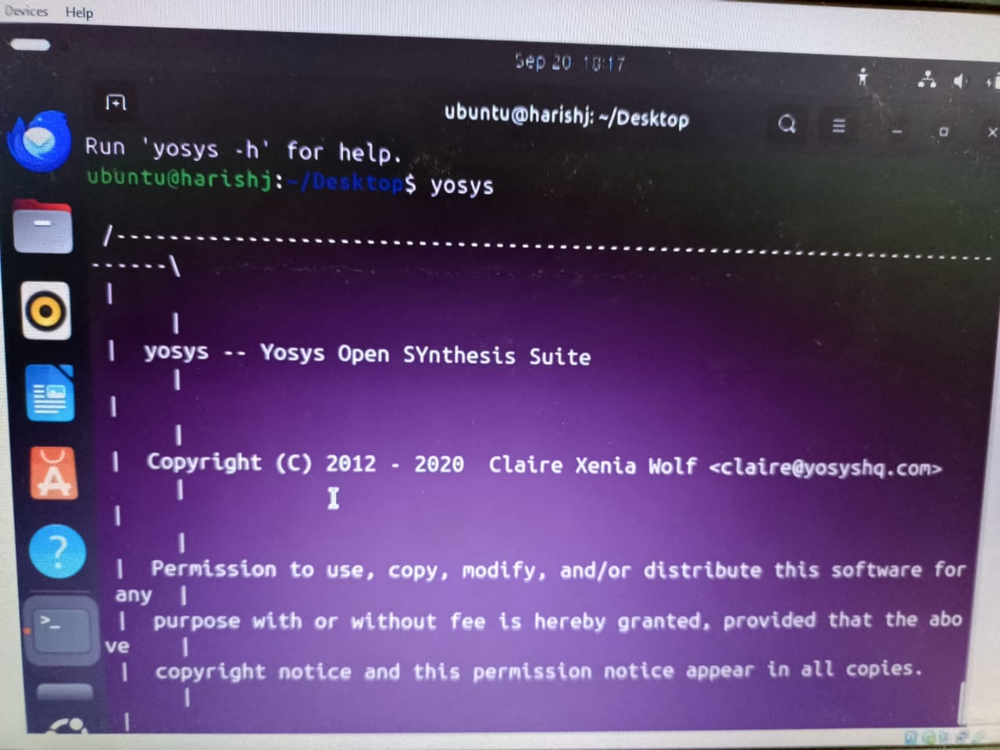
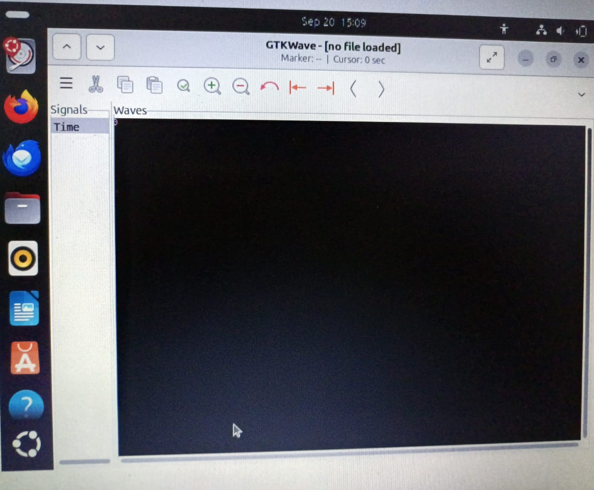

#  Task 2: Tool Installation & Setup

---

## 1. Machine Requirements

* **RAM:** 6 GB
* **Storage:** 50 GB HDD
* **OS:** Ubuntu 20.04+
* **CPU:** 4 vCPUs

> Recommended: Use **Oracle VirtualBox**
> [ Download VirtualBox](https://www.virtualbox.org/wiki/Downloads)

---

## 2. Tool Installation

### **1. Yosys (Open-source Synthesis Tool)**

```bash
# Update system
sudo apt-get update

# Clone Yosys repo
git clone https://github.com/YosysHQ/yosys.git
cd yosys

# Install dependencies
sudo apt install make build-essential clang bison flex \
libreadline-dev gawk tcl-dev libffi-dev git \
graphviz xdot pkg-config python3 libboost-system-dev \
libboost-python-dev libboost-filesystem-dev zlib1g-dev

# Build & install Yosys
make config-gcc
make
sudo make install
```


           ## Yosys installed successfully.
---

### **2. Icarus Verilog (iverilog)**

```bash
sudo apt-get update
sudo apt-get install iverilog
```


## Iverilog installed successfully
---

### **3. GTKWave (Waveform Viewer)**

```bash
sudo apt-get update
sudo apt install gtkwave
```




## gtkwave installed successfully
---

### **4. OpenSTA (Optional for SFAL participants)**

* Repository: [OpenSTA](https://github.com/The-OpenROAD-Project/OpenSTA)
* Follow the instructions in the repo if required.

---

## 3. Verification

Check that tools are installed successfully:

```bash
yosys -V       # Check Yosys version
iverilog -V    # Check Icarus Verilog version
gtkwave --version  # Check GTKWave version
---
